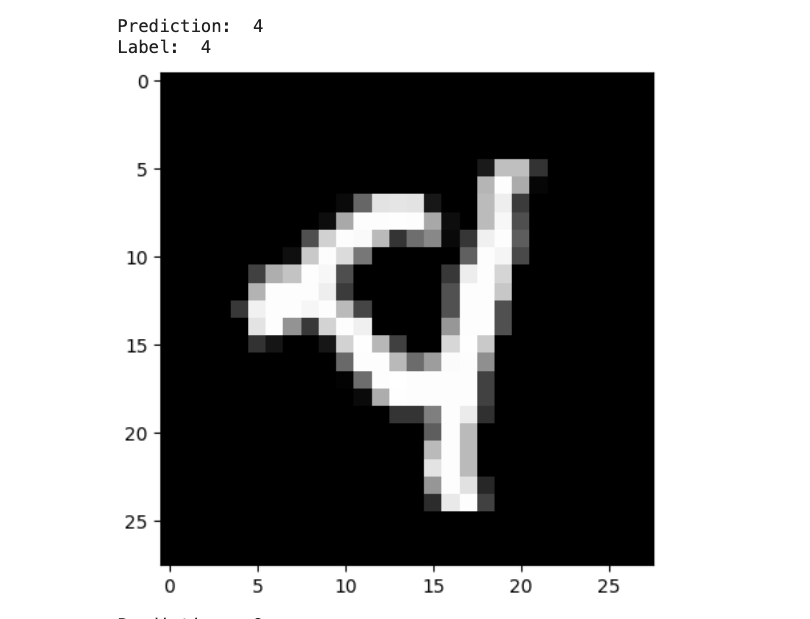

# MNIST Digit Classification

## Overview
This project features a custom-built multi-layer perceptron (MLP) for MNIST digit classification, uniquely created without standard deep learning frameworks like PyTorch, TensorFlow, or Keras.

The model utilizes a total of four layers for predictions, comprising an input layer with 784 neurons, two hidden layers with 128 and 64 neurons respectively, and an output layer containing 10 neurons.

Below is an example of a succesful prediction:

## Highlights
- **He Initialization & SGD:** Employs He initialization and Stochastic Gradient Descent for effective training.
- **Built with Numpy, Pandas, and Matplotlib:** Relies solely on these Python libraries for all computational, data handling, and visualization needs.

## Performance
Achieves ~91% accuracy on both training and test datasets in under 200 training iterations.

